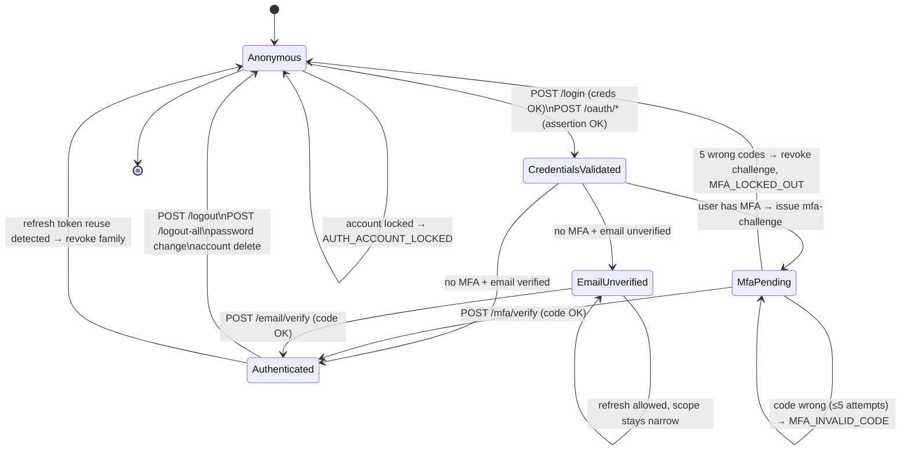

# v2 Auth Login State Machine

> Status: STRAWMAN. See [README.md](./README.md).

The login flow is a state machine. Drawing it explicitly makes the contract obvious — every endpoint is "what state am I in, what event just fired, what state am I in next."

---

## States

| State | Meaning | Tokens held |
|-------|---------|-------------|
| `Anonymous` | No credentials presented or all rejected. | none |
| `CredentialsValidated` | First factor passed (password OK or OAuth assertion verified). MFA status not yet known. | (transient — never observed by client) |
| `MfaPending` | First factor passed, MFA enrollment exists, second factor not yet supplied. | `mfa-challenge` code token |
| `EmailUnverified` | First factor passed, no MFA required, but email is not yet verified. | access + refresh, `mfa_verified: false`, `scope: "user:unverified"` |
| `Authenticated` | Fully logged in. | access + refresh, `mfa_verified: true` if MFA enrolled |

Notes:
- `CredentialsValidated` is internal — clients never see it. It exists as a logical step between "creds OK" and "what next?"
- `EmailUnverified` is an addressable state with reduced scope. Users can browse but cannot transact. Endpoints check scope, not just authenticated-ness.

---

## Transition diagram (Mermaid)



---

## Transition table

Every row: from-state, event, conditions, action, tokens issued, to-state, possible errors.

| From | Event | Condition | Action | Tokens issued | To | Errors |
|------|-------|-----------|--------|---------------|----|----|
| Anonymous | `POST /v2/auth/login` | credentials valid, MFA enrolled | issue mfa-challenge | `mfa-challenge` (5 min) | MfaPending | — |
| Anonymous | `POST /v2/auth/login` | credentials valid, no MFA, email verified | create session, issue pair | access + refresh | Authenticated | — |
| Anonymous | `POST /v2/auth/login` | credentials valid, no MFA, email unverified | create session, issue pair (narrow scope) | access + refresh (`scope: user:unverified`) | EmailUnverified | — |
| Anonymous | `POST /v2/auth/login` | credentials invalid | increment lockout counter | none | Anonymous | `AUTH_INVALID_CREDENTIALS` (or `AUTH_ACCOUNT_LOCKED` after threshold) |
| Anonymous | `POST /v2/auth/oauth/google` | Google id-token verified, user exists | as login above | access + refresh OR mfa-challenge | Authenticated/MfaPending/EmailUnverified | `OAUTH_INVALID_TOKEN`, `OAUTH_EMAIL_CONFLICT` |
| Anonymous | `POST /v2/auth/oauth/google` | id-token verified, user does not exist | create user (email pre-verified by Google), issue pair | access + refresh | Authenticated | — |
| Anonymous | `POST /v2/auth/oauth/apple` | Apple id-token verified | as Google | as Google | as Google | `OAUTH_INVALID_TOKEN`, `OAUTH_EMAIL_CONFLICT` |
| MfaPending | `POST /v2/auth/mfa/verify` | TOTP code valid | consume challenge, create session, issue pair | access + refresh (`mfa_verified: true`) | Authenticated | — |
| MfaPending | `POST /v2/auth/mfa/verify` | TOTP code invalid, attempts < 5 | increment attempts | none | MfaPending | `MFA_INVALID_CODE` |
| MfaPending | `POST /v2/auth/mfa/verify` | TOTP code invalid, attempts = 5 | revoke challenge token | none | Anonymous | `MFA_LOCKED_OUT` |
| MfaPending | challenge token expires | — | — | none | Anonymous | `TOKEN_EXPIRED` on next call |
| EmailUnverified | `POST /v2/auth/email/verify` | code valid | mark email verified, broaden scope on next refresh | none (current pair stays) | EmailUnverified → Authenticated on refresh | — |
| EmailUnverified | `POST /v2/auth/refresh` | refresh valid | rotate, broaden scope if email now verified | new access + refresh | Authenticated if verified, else EmailUnverified | `TOKEN_REUSE_DETECTED` |
| Authenticated | `POST /v2/auth/refresh` | current jti, family alive | rotate | new access + refresh | Authenticated | — |
| Authenticated | `POST /v2/auth/refresh` | retired jti, family alive | revoke family | none | Anonymous | `TOKEN_REUSE_DETECTED` |
| Authenticated | `POST /v2/auth/logout` | — | revoke this family | none | Anonymous | — |
| Authenticated | `POST /v2/auth/logout-all` | — | revoke all families for user | none | Anonymous | — |
| Authenticated | `POST /v2/auth/password/change` | old pwd valid, new pwd valid | revoke all families except current | new access + refresh (current family kept) | Authenticated | `AUTH_INVALID_CREDENTIALS`, `VALIDATION_PASSWORD_*` |
| Authenticated | `POST /v2/auth/account/delete` | recent-auth code valid | revoke all families, soft-delete user | none | Anonymous | `AUTH_RECENT_AUTH_REQUIRED` |

---

## Error transitions

| Trigger | Effect |
|---------|--------|
| Account locked (≥10 failed login attempts in 15 min, per-account) | Subsequent login attempts return `AUTH_ACCOUNT_LOCKED` until lockout expires. Successful password reset clears the lock. |
| Password expired (admin scope only — staff passwords rotate annually) | Login succeeds but issues `code:reset` instead of session pair. Client must reset before getting access. State: `Anonymous → CredentialsValidated → Anonymous + reset code`. |
| Account soft-deleted | All login attempts return `AUTH_ACCOUNT_DELETED`. Refresh tokens revoked at delete time. |
| MFA failed attempts exceeded (5) | Challenge token invalidated; user re-enters first factor. After 3 challenge cycles in 1h, account flagged for review. |
| Refresh family revoked (logout-all, password change, reuse detected) | Next refresh returns `TOKEN_REVOKED` or `TOKEN_REUSE_DETECTED`. Client transitions to Anonymous. |

---

## Walkthrough 1: Email/password login, no MFA

```
Client                                 Server                                Redis            DB
  |                                       |                                    |               |
  |-- POST /v2/auth/login ---------------->                                    |               |
  |   { email, password,                  |--- find user by email -------------|-------------->|
  |     tokenDelivery: "cookie" }         |<-- user record --------------------|---------------|
  |                                       |--- bcrypt compare ----------->     |               |
  |                                       |    (success)                       |               |
  |                                       |--- check MFA enrolled (no) -- ---->|               |
  |                                       |--- check email verified (yes)----->|               |
  |                                       |--- create session record --------- ->family_id:... |
  |                                       |--- sign access (15m) + refresh (30d)               |
  |<-- 200 { user, csrf } -----------------|                                    |               |
  |    Set-Cookie: bz_at=...; bz_rt=...;  |                                    |               |
  |                bz_csrf=...            |                                    |               |
  | (state: Authenticated)                |                                    |               |
```

## Walkthrough 2: Email/password login WITH MFA

```
Client                                 Server                                Redis
  |                                       |                                    |
  |-- POST /v2/auth/login ----------------->                                   |
  |<-- 200 { status: "mfa_required",      |                                    |
  |       challengeToken: "<jwt>" } ------|--- store purpose_nonce ----------->|
  | (state: MfaPending)                   |                                    |
  |                                       |                                    |
  |-- POST /v2/auth/mfa/verify ----------->                                    |
  |   Authorization: Bearer <challenge>   |                                    |
  |   { code: "123456" }                  |--- consume nonce ---------------- >|
  |                                       |--- verify TOTP                     |
  |                                       |--- create session                  |
  |<-- 200 { user, accessToken, ... } ----|                                    |
  | (state: Authenticated, mfa_verified=true)                                  |
```

## Walkthrough 3: OAuth login (Google)

```
Client (mobile)                         Server                              Redis
  |                                       |                                    |
  |-- POST /v2/auth/oauth/google --------->                                    |
  |   { idToken, tokenDelivery:"bearer", |                                    |
  |     deviceId }                        |--- verify with Google JWKS         |
  |                                       |--- find user by email              |
  |                                       |    (case A: exists)                |
  |                                       |    (case B: not exists → create)   |
  |                                       |--- if MFA → issue challenge        |
  |                                       |    else → issue pair               |
  |<-- 200 { user, accessToken,           |                                    |
  |          refreshToken, expiresIn,     |                                    |
  |          status: "ok"|"mfa_required" }|                                    |
```

`expiresIn` here is **seconds-from-now** for the access token (e.g. `900`), separate from the JWT's `exp` claim (absolute Unix seconds). Both are present and unambiguous, fixing BUG-035.
